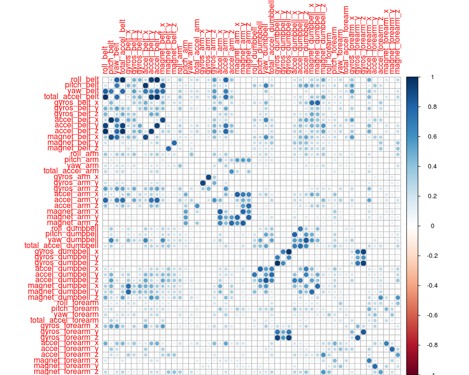
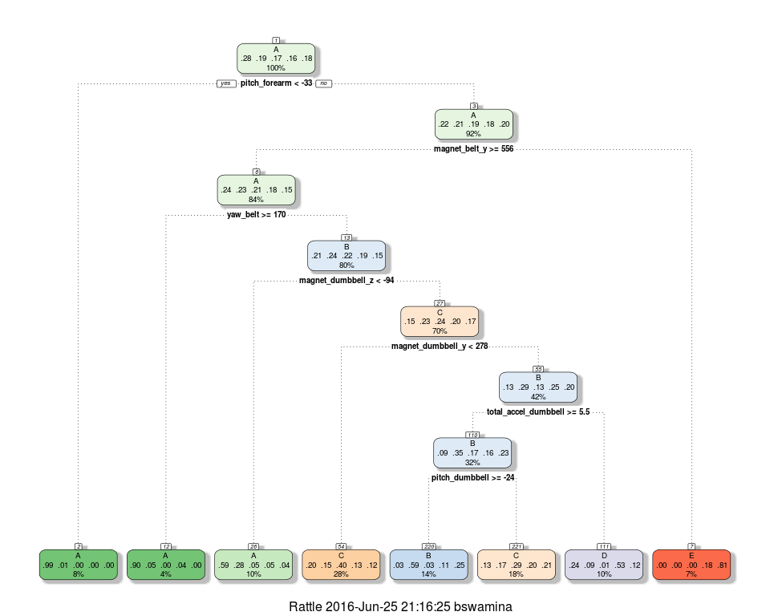
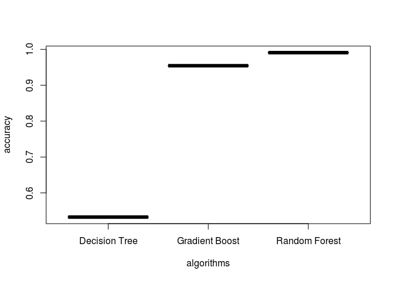

# Practical Machine Learning - Prediction Project
Bhaskar S  
25th Jun 2016  
<br/>

## __Predict Manner of Exercise__
<br/>

### __Introduction__
<br/>

One thing that people regularly do is quantify how much of a particular activity they do, but they rarely quantify how well they do it. In this project, your goal will be to use data from accelerometers on the belt, forearm, arm, and dumbell of 6 participants.

The goal of this project is to predict the manner in which they did the exercise. This is the `classe` variable in the training set. We may use any of the other variables to predict with. This report describes how we get and clean the data, build the different models, how we used cross validation to test the models, and how we made our final model choice. We will also use our prediction model to predict 20 different test cases.

Using devices such as Jawbone Up, Nike FuelBand, and Fitbit it is now possible to collect a large amount of data about personal activity relatively inexpensively. These type of devices are part of the quantified self movement – a group of enthusiasts who take measurements about themselves regularly to improve their health, to find patterns in their behavior, or because they are tech geeks. One thing that people regularly do is quantify how much of a particular activity they do, but they rarely quantify how well they do it. In this project, your goal will be to use data from accelerometers on the belt, forearm, arm, and dumbell of 6 participants. They were asked to perform barbell lifts correctly and incorrectly in 5 different ways. More information is available from the website here: http://groupware.les.inf.puc-rio.br/har.

<br/>
### __Getting Data__
<br/>

The training data for this project are available here:

https://d396qusza40orc.cloudfront.net/predmachlearn/pml-training.csv

The test data are available here:

https://d396qusza40orc.cloudfront.net/predmachlearn/pml-testing.csv

We will download the training and test __csv__ files from the above mentioned locations into the directory __~/Downloads/DATA__ and load into the data in these files as `data.frame` objects  `training.data` and `testing.data` respectively.


```r
### Initialize the url and file variables
training.url <- "https://d396qusza40orc.cloudfront.net/predmachlearn/pml-training.csv"
testing.url <- "https://d396qusza40orc.cloudfront.net/predmachlearn/pml-testing.csv"
training.csv <- "~/Downloads/DATA/pml-training.csv"
testing.csv <- "~/Downloads/DATA/pml-testing.csv"

### Check and create the directrory
if (!dir.exists('~/Downloads/DATA')) {
    dir.create('~/Downloads/DATA', recursive=TRUE)
}

### Download the csv files
if (!file.exists(training.csv)) {
    download.file(training.url, destfile=training.csv)
}
if (!file.exists(testing.csv)) {
    download.file(testing.url, destfile=testing.csv)
}

### Clean up
rm(training.url, testing.url)

### Load the csv files as data.frame objects
training.data <- read.csv(training.csv)
testing.data <- read.csv(testing.csv)

### Clean up
rm(training.csv, testing.csv)

### How many rows and columns
dim(training.data)
```

```
## [1] 19622   160
```

From the above, we observe that the `training.data` data set contains 19622 rows and 160 columns.

<br/>
### __Cleaning Data__
<br/>

Often times a given data set will contain predictors that will take a set of unique constant values (zero variance) across the sample. Such predictors (called the near zero variance predictors) will not be useful in prediction and should be removed.

We will use the __nearZeroVar__ method from the __caret__ package to identify the near zero variance predictors from our `training.data`.


```r
### Load the caret package
library(caret)

### Identify near zero variance predictors (if any)
zero.var <- nearZeroVar(training.data, saveMetrics=TRUE)

### List the names of the near zero variance predictors
names(training.data)[zero.var$nzv]
```

```
##  [1] "new_window"              "kurtosis_roll_belt"     
##  [3] "kurtosis_picth_belt"     "kurtosis_yaw_belt"      
##  [5] "skewness_roll_belt"      "skewness_roll_belt.1"   
##  [7] "skewness_yaw_belt"       "max_yaw_belt"           
##  [9] "min_yaw_belt"            "amplitude_yaw_belt"     
## [11] "avg_roll_arm"            "stddev_roll_arm"        
## [13] "var_roll_arm"            "avg_pitch_arm"          
## [15] "stddev_pitch_arm"        "var_pitch_arm"          
## [17] "avg_yaw_arm"             "stddev_yaw_arm"         
## [19] "var_yaw_arm"             "kurtosis_roll_arm"      
## [21] "kurtosis_picth_arm"      "kurtosis_yaw_arm"       
## [23] "skewness_roll_arm"       "skewness_pitch_arm"     
## [25] "skewness_yaw_arm"        "max_roll_arm"           
## [27] "min_roll_arm"            "min_pitch_arm"          
## [29] "amplitude_roll_arm"      "amplitude_pitch_arm"    
## [31] "kurtosis_roll_dumbbell"  "kurtosis_picth_dumbbell"
## [33] "kurtosis_yaw_dumbbell"   "skewness_roll_dumbbell" 
## [35] "skewness_pitch_dumbbell" "skewness_yaw_dumbbell"  
## [37] "max_yaw_dumbbell"        "min_yaw_dumbbell"       
## [39] "amplitude_yaw_dumbbell"  "kurtosis_roll_forearm"  
## [41] "kurtosis_picth_forearm"  "kurtosis_yaw_forearm"   
## [43] "skewness_roll_forearm"   "skewness_pitch_forearm" 
## [45] "skewness_yaw_forearm"    "max_roll_forearm"       
## [47] "max_yaw_forearm"         "min_roll_forearm"       
## [49] "min_yaw_forearm"         "amplitude_roll_forearm" 
## [51] "amplitude_yaw_forearm"   "avg_roll_forearm"       
## [53] "stddev_roll_forearm"     "var_roll_forearm"       
## [55] "avg_pitch_forearm"       "stddev_pitch_forearm"   
## [57] "var_pitch_forearm"       "avg_yaw_forearm"        
## [59] "stddev_yaw_forearm"      "var_yaw_forearm"
```

From the above, it is clear we have quite a few predictors that have near zero variance.

We will remove all the predictors that have near zero variance and save the results in a new `data.frame` called `training.0`.


```r
### Identify columns indexes of predictors to remove
zero.var.index <- nearZeroVar(training.data, saveMetrics=FALSE)

### Remove some predictors that add no value
training.0 <- training.data[, -zero.var.index]

### Clean up
rm(zero.var, zero.var.index, training.data)
```

Next, we need to identify predictors that have missing values as they add no value in the modeling.


```r
### Identify columns with missing values
colnames(training.0)[colSums(is.na(training.0)) > 0]
```

```
##  [1] "max_roll_belt"            "max_picth_belt"          
##  [3] "min_roll_belt"            "min_pitch_belt"          
##  [5] "amplitude_roll_belt"      "amplitude_pitch_belt"    
##  [7] "var_total_accel_belt"     "avg_roll_belt"           
##  [9] "stddev_roll_belt"         "var_roll_belt"           
## [11] "avg_pitch_belt"           "stddev_pitch_belt"       
## [13] "var_pitch_belt"           "avg_yaw_belt"            
## [15] "stddev_yaw_belt"          "var_yaw_belt"            
## [17] "var_accel_arm"            "max_picth_arm"           
## [19] "max_yaw_arm"              "min_yaw_arm"             
## [21] "amplitude_yaw_arm"        "max_roll_dumbbell"       
## [23] "max_picth_dumbbell"       "min_roll_dumbbell"       
## [25] "min_pitch_dumbbell"       "amplitude_roll_dumbbell" 
## [27] "amplitude_pitch_dumbbell" "var_accel_dumbbell"      
## [29] "avg_roll_dumbbell"        "stddev_roll_dumbbell"    
## [31] "var_roll_dumbbell"        "avg_pitch_dumbbell"      
## [33] "stddev_pitch_dumbbell"    "var_pitch_dumbbell"      
## [35] "avg_yaw_dumbbell"         "stddev_yaw_dumbbell"     
## [37] "var_yaw_dumbbell"         "max_picth_forearm"       
## [39] "min_pitch_forearm"        "amplitude_pitch_forearm" 
## [41] "var_accel_forearm"
```

From the above, it is clear we have quite a few predictors that have missing values.

We will remove all the predictors that have missing values and save the results in a new `data.frame` called `training.1`.


```r
### Identify columns indexes of predictors to remove
na.index <- c()
for (i in 1:ncol(training.0)) {
    if (sum(is.na(training.0[,i])) >= nrow(training.0)/2) {
        na.index <- c(na.index, i)
    }
}

### Remove some predictors with missing values
training.1 <- training.0[, -na.index]

### Clean up
rm(na.index, training.0)
```

Let us look at the first few rows to see if there is any other clean to be done.


```r
### Display first 5 rows and all columns
head(training.1)
```

```
##   X user_name raw_timestamp_part_1 raw_timestamp_part_2   cvtd_timestamp
## 1 1  carlitos           1323084231               788290 05/12/2011 11:23
## 2 2  carlitos           1323084231               808298 05/12/2011 11:23
## 3 3  carlitos           1323084231               820366 05/12/2011 11:23
## 4 4  carlitos           1323084232               120339 05/12/2011 11:23
## 5 5  carlitos           1323084232               196328 05/12/2011 11:23
## 6 6  carlitos           1323084232               304277 05/12/2011 11:23
##   num_window roll_belt pitch_belt yaw_belt total_accel_belt gyros_belt_x
## 1         11      1.41       8.07    -94.4                3         0.00
## 2         11      1.41       8.07    -94.4                3         0.02
## 3         11      1.42       8.07    -94.4                3         0.00
## 4         12      1.48       8.05    -94.4                3         0.02
## 5         12      1.48       8.07    -94.4                3         0.02
## 6         12      1.45       8.06    -94.4                3         0.02
##   gyros_belt_y gyros_belt_z accel_belt_x accel_belt_y accel_belt_z
## 1         0.00        -0.02          -21            4           22
## 2         0.00        -0.02          -22            4           22
## 3         0.00        -0.02          -20            5           23
## 4         0.00        -0.03          -22            3           21
## 5         0.02        -0.02          -21            2           24
## 6         0.00        -0.02          -21            4           21
##   magnet_belt_x magnet_belt_y magnet_belt_z roll_arm pitch_arm yaw_arm
## 1            -3           599          -313     -128      22.5    -161
## 2            -7           608          -311     -128      22.5    -161
## 3            -2           600          -305     -128      22.5    -161
## 4            -6           604          -310     -128      22.1    -161
## 5            -6           600          -302     -128      22.1    -161
## 6             0           603          -312     -128      22.0    -161
##   total_accel_arm gyros_arm_x gyros_arm_y gyros_arm_z accel_arm_x
## 1              34        0.00        0.00       -0.02        -288
## 2              34        0.02       -0.02       -0.02        -290
## 3              34        0.02       -0.02       -0.02        -289
## 4              34        0.02       -0.03        0.02        -289
## 5              34        0.00       -0.03        0.00        -289
## 6              34        0.02       -0.03        0.00        -289
##   accel_arm_y accel_arm_z magnet_arm_x magnet_arm_y magnet_arm_z
## 1         109        -123         -368          337          516
## 2         110        -125         -369          337          513
## 3         110        -126         -368          344          513
## 4         111        -123         -372          344          512
## 5         111        -123         -374          337          506
## 6         111        -122         -369          342          513
##   roll_dumbbell pitch_dumbbell yaw_dumbbell total_accel_dumbbell
## 1      13.05217      -70.49400    -84.87394                   37
## 2      13.13074      -70.63751    -84.71065                   37
## 3      12.85075      -70.27812    -85.14078                   37
## 4      13.43120      -70.39379    -84.87363                   37
## 5      13.37872      -70.42856    -84.85306                   37
## 6      13.38246      -70.81759    -84.46500                   37
##   gyros_dumbbell_x gyros_dumbbell_y gyros_dumbbell_z accel_dumbbell_x
## 1                0            -0.02             0.00             -234
## 2                0            -0.02             0.00             -233
## 3                0            -0.02             0.00             -232
## 4                0            -0.02            -0.02             -232
## 5                0            -0.02             0.00             -233
## 6                0            -0.02             0.00             -234
##   accel_dumbbell_y accel_dumbbell_z magnet_dumbbell_x magnet_dumbbell_y
## 1               47             -271              -559               293
## 2               47             -269              -555               296
## 3               46             -270              -561               298
## 4               48             -269              -552               303
## 5               48             -270              -554               292
## 6               48             -269              -558               294
##   magnet_dumbbell_z roll_forearm pitch_forearm yaw_forearm
## 1               -65         28.4         -63.9        -153
## 2               -64         28.3         -63.9        -153
## 3               -63         28.3         -63.9        -152
## 4               -60         28.1         -63.9        -152
## 5               -68         28.0         -63.9        -152
## 6               -66         27.9         -63.9        -152
##   total_accel_forearm gyros_forearm_x gyros_forearm_y gyros_forearm_z
## 1                  36            0.03            0.00           -0.02
## 2                  36            0.02            0.00           -0.02
## 3                  36            0.03           -0.02            0.00
## 4                  36            0.02           -0.02            0.00
## 5                  36            0.02            0.00           -0.02
## 6                  36            0.02           -0.02           -0.03
##   accel_forearm_x accel_forearm_y accel_forearm_z magnet_forearm_x
## 1             192             203            -215              -17
## 2             192             203            -216              -18
## 3             196             204            -213              -18
## 4             189             206            -214              -16
## 5             189             206            -214              -17
## 6             193             203            -215               -9
##   magnet_forearm_y magnet_forearm_z classe
## 1              654              476      A
## 2              661              473      A
## 3              658              469      A
## 4              658              469      A
## 5              655              473      A
## 6              660              478      A
```

From the above, we observe that the first six columns are just ids and times. These columns are not going to be useful in prediction and hence we can remove them. We will save the results in a new `data.frame` called `training.2`.


```r
### Remove the first 6 columns
training.2 <- training.1[, -c(1, 2, 3, 4, 5, 6)]

### Clean up
rm(training.1)
```

<br/>
### __Exploratory Analysis__
<br/>

Now that we have cleaned the data set, the next step is to identify if there are any correlated predictors.


```r
### Load the corrplot package
library(corrplot)

### Create a correlation matrix - we are not interested in the sign
cor.matrix <- abs(cor(training.2[,-53]))

### Predictors will be strongly related to themselves - zero the diagonal
diag(cor.matrix) <- 0

### Plot the correlation
corrplot(cor.matrix)
```

<!-- -->

From the above plot it is clear that there are some predictors that are highly correlated to some others. Predictors that are highly correlated increase the noise and reduce the accuracy of the model. Hence, it is better to remove the highly correlated predictors. We will save the results in a new `data.frame` called `training.3`.


```r
### Identify the index of the predictors that are highly correlated
cor.index <- findCorrelation(cor.matrix, cutoff=0.8)

### Remove the predictors that are corellated
training.3 <- training.2[, -cor.index]

### Clean up
rm(cor.matrix, cor.index, training.2)

### How many rows and columns
dim(training.3)
```

```
## [1] 19622    40
```

At this point we have a clean data set and from the above, we observe that the `training.3` data set contains 19622 rows and 40 columns.

<br/>
### __Predictive Modeling__
<br/>

Since `classe` is a categorical variable with 5 distict values - __A, B, C, D, E__, this is a classification problem vs a regression problem. For the classification modeling, we will try the __Decision Tree__, __Random Forest__, and the __Gradient Boost__ supervised machine learning algorithms.

For any good modeling approach, one needs to have a traing data set and a validation data set. We will use the data in `training.3` to create a __60/40__ split of the training set and validation set.


```r
### Set the seed for reproducibility
set.seed(1000)

### Create a 60% training set and 40% validation set
inTrain <- createDataPartition(training.3$classe, p=0.6)[[1]]
training.set <- training.3[inTrain,]
validation.set <- training.3[-inTrain,]

### Clean up
rm(inTrain, training.3)
```

To prevent the model from overfitting (which can result in prediction errors and reduced accuracy), we use the k-folds cross validation during model building. In this case we use a 10-fold cross validation.


```r
### 10-fold cross validation
train.control <- trainControl(method='cv', number=10)
```

<br/>
#### __Predictive Modeling - Decision Tree__
<br/>

We will start modeling with a __Decision Tree__ algorithm using the `training.set` data.


```r
### Train the model using decision tree
model.rpart <- train(classe ~ ., method='rpart',
                     trControl=train.control, data=training.set)
```

The following plot depicts the decision tree in a pictorial view:


```r
### Load the rattle package
library(rattle)

### Display the decision tree
fancyRpartPlot(model.rpart$finalModel)
```

<!-- -->

Now, we predict the outcome using the decision tree model `model.rpart` we just created on the `validation.set` data and determine the accuracy of the prediction using the confusion matrix.


```r
### Predict the outcome on the validation set
predict.rpart <- predict(model.rpart, validation.set)

### Determine the accuracy of prediction
confusionMatrix(predict.rpart, validation.set$classe)$overall[1]
```

```
##  Accuracy 
## 0.5326281
```

<br/>
#### __Predictive Modeling - Random Forest__
<br/>

We will next train a model with the __Random Forest__ algorithm using the `training.set` data.


```r
### Load the randomForest package
library(randomForest)

### Train the model using random forest
model.rf <- randomForest(classe ~ ., data=training.set)
```

Now, we predict the outcome using the random forest model `model.rf` we just created on the `validation.set` data and determine the accuracy of the prediction using the confusion matrix.


```r
### Predict the outcome on the validation set
predict.rf <- predict(model.rf, validation.set)

### Determine the accuracy of prediction
confusionMatrix(predict.rf, validation.set$classe)$overall[1]
```

```
##  Accuracy 
## 0.9908233
```

<br/>
#### __Predictive Modeling - Gradient Boost__
<br/>

We will finally train a model with the __Gradient Boost__ algorithm using the `training.set` data.


```r
### Train the model using gradient boost
gbm.out <- capture.output(
    model.gbm <- train(classe ~ ., method='gbm',
                       trControl=train.control, data=training.set)
)
rm(gbm.out)
```

Now, we predict the outcome using the gradient boost model `model.gbm` we just created on the `validation.set` data and determine the accuracy of the prediction using the confusion matrix.


```r
### Predict the outcome on the validation set
predict.gbm <- predict(model.gbm, validation.set)

### Determine the accuracy of prediction
confusionMatrix(predict.gbm, validation.set$classe)$overall[1]
```

```
##  Accuracy 
## 0.9543717
```

We will now summarize the accuracy of the three models.


```r
### Plot the algorithms vs accuracy
algorithms <- c('Decision Tree', 'Random Forest', 'Gradient Boost')
accuracy <- c(confusionMatrix(predict.rpart, validation.set$classe)$overall[1],
              confusionMatrix(predict.rf, validation.set$classe)$overall[1],
              confusionMatrix(predict.gbm, validation.set$classe)$overall[1])
prediction.results <- data.frame(algorithms=algorithms, accuracy=accuracy)
plot(prediction.results, lwd=2)
```

<!-- -->

From the above plot, we clearly see that the __Random Forest__ algorithm is the most accurate model for prediction and hence we choose that model.
<br/>

### __Final Model Testing__
<br/>

Now that we have chosen the __Random Forest__ predictive model `model.rf` due to its high accuracy, we will predict the outcomes on the `testing.data` data set that was downloaded and set aside for final testing.


```r
### Predict the outcome on the testing set
predict.final <- predict(model.rf, testing.data)

### Display the final outcomes
predict.final
```

```
##  1  2  3  4  5  6  7  8  9 10 11 12 13 14 15 16 17 18 19 20 
##  B  A  B  A  A  E  D  B  A  A  B  C  B  A  E  E  A  B  B  B 
## Levels: A B C D E
```
