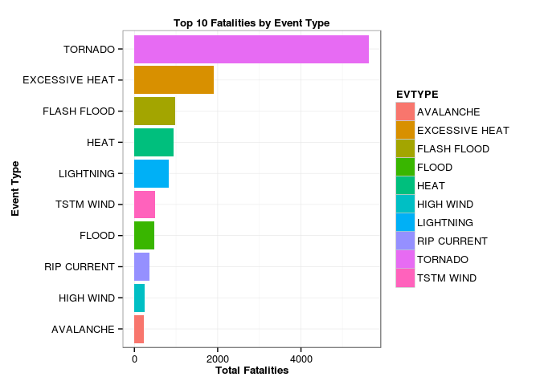
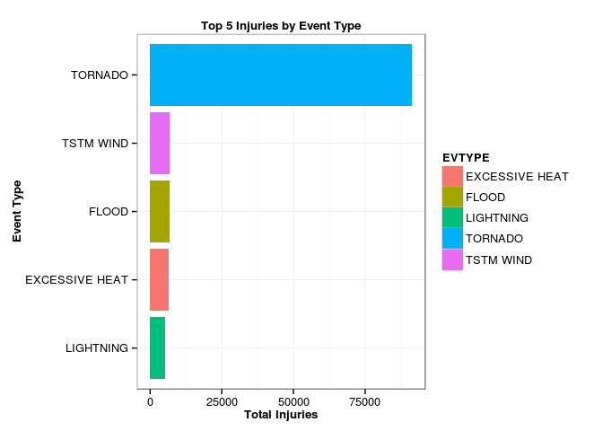
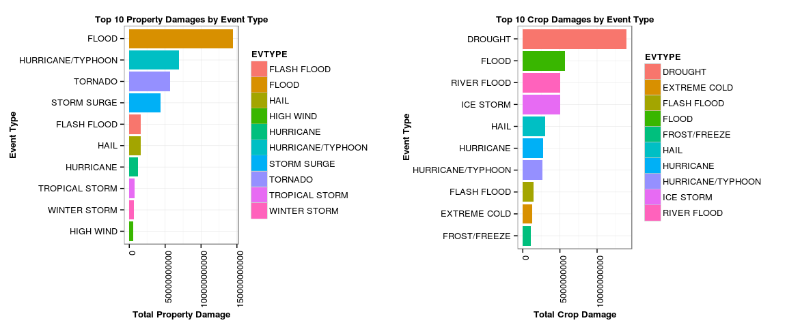

<br/>

## __Data Analysis of the Weather Events with most Impact on Population Health & Property__
<br/>

### __Synopsis__
<br/>

The basic goal of this analysis is to explore the NOAA `Storm` Database and answer some basic questions about the severe weather events that have the most impact on population health (fatalities and injuries) and property damage (including crop damage). Our analysis concludes that __TORNADO__ causes the most fatalities and injuries, __FLOOD__ causes the most property damage, and __DROUGHT__ causes the most crop damage.

<br/>

### __Data Processing__
<br/>

#### __1. Setup and Initialization__
<br/>

For this analysis, we will be using the R packages `R.utils`, `data.table`, `ggplot2`, and `gridExtra`. The following code segment loads the desired libraries:


```r
library(R.utils)
library(data.table)
library(ggplot2)
library(gridExtra)
```

We will define a function that will download the `Storm` dataset (compressed with bzip2) from a specified __url__ and uncompress it in the specified __dir__ location as a CSV __file__. The following code segment defines the function called __setup.dataset__ that takes the 3 arguments:


```r
setup.dataset <- function(url, dir, file) {
    bz2 <- 'repdata-data-StormData.csv.bz2'
    
    cat('[INFO]: Ready to download from url:', url, '\n')
    
    ### Download
    download.file(url,
                  paste(dir, bz2, sep='/'),
                  mode = 'wb',
                  method = 'curl')
    
    cat('[INFO]: Ready to unzip file:', bz2, '\n')
    
    ### Unzip
    if (file.exists(paste(dir, bz2, sep='/'))) {
        bunzip2(paste(dir, bz2, sep='/'),
                paste(dir, file, sep='/'),
                remove = FALSE)
    }
    
    cat('[INFO]: Download and setup completed\n')
}
```

We initialize few variables that will be referenced during the download and setup of the dataset. The following code segment performs the desired initializations:


```r
url <- 'https://d396qusza40orc.cloudfront.net/repdata%2Fdata%2FStormData.csv.bz2'
dir <- '~/Downloads/DATA'
file <- 'repdata-data-StormData.csv'
csv.file <- paste(dir, file, sep='/')
```

The following code segment will actually download, unzip and setup the Storm dataset:


```r
if (!file.exists(csv.file)) {
    setup.dataset(url, dir, file)
}

if (!file.exists(csv.file) || file.info(csv.file)$size <= 0) {
    stop(paste("ERROR: CSV file", csv.file, "not valid"))
}
```
<br/>

#### __2. Loading and Preprocessing the Data__
<br/>

We download the dataset and extract the file repdata-data-StormData.csv to the ~/Downloads/DATA directory. The following code loads the csv data into a `data.table` called __data__:


```r
data <- fread(csv.file)
```

```
## 
Read 34.1% of 967216 rows
Read 54.8% of 967216 rows
Read 78.6% of 967216 rows
Read 902297 rows and 37 (of 37) columns from 0.523 GB file in 00:00:06
```

```
## Warning in fread(csv.file): Read less rows (902297) than were allocated
## (967216). Run again with verbose=TRUE and please report.
```

```r
dim(data)
```

```
## [1] 902297     37
```

```r
str(data)
```

```
## Classes 'data.table' and 'data.frame':	902297 obs. of  37 variables:
##  $ STATE__   : num  1 1 1 1 1 1 1 1 1 1 ...
##  $ BGN_DATE  : chr  "4/18/1950 0:00:00" "4/18/1950 0:00:00" "2/20/1951 0:00:00" "6/8/1951 0:00:00" ...
##  $ BGN_TIME  : chr  "0130" "0145" "1600" "0900" ...
##  $ TIME_ZONE : chr  "CST" "CST" "CST" "CST" ...
##  $ COUNTY    : num  97 3 57 89 43 77 9 123 125 57 ...
##  $ COUNTYNAME: chr  "MOBILE" "BALDWIN" "FAYETTE" "MADISON" ...
##  $ STATE     : chr  "AL" "AL" "AL" "AL" ...
##  $ EVTYPE    : chr  "TORNADO" "TORNADO" "TORNADO" "TORNADO" ...
##  $ BGN_RANGE : num  0 0 0 0 0 0 0 0 0 0 ...
##  $ BGN_AZI   : chr  "" "" "" "" ...
##  $ BGN_LOCATI: chr  "" "" "" "" ...
##  $ END_DATE  : chr  "" "" "" "" ...
##  $ END_TIME  : chr  "" "" "" "" ...
##  $ COUNTY_END: num  0 0 0 0 0 0 0 0 0 0 ...
##  $ COUNTYENDN: logi  NA NA NA NA NA NA ...
##  $ END_RANGE : num  0 0 0 0 0 0 0 0 0 0 ...
##  $ END_AZI   : chr  "" "" "" "" ...
##  $ END_LOCATI: chr  "" "" "" "" ...
##  $ LENGTH    : num  14 2 0.1 0 0 1.5 1.5 0 3.3 2.3 ...
##  $ WIDTH     : num  100 150 123 100 150 177 33 33 100 100 ...
##  $ F         : chr  "3" "2" "2" "2" ...
##  $ MAG       : num  0 0 0 0 0 0 0 0 0 0 ...
##  $ FATALITIES: num  0 0 0 0 0 0 0 0 1 0 ...
##  $ INJURIES  : num  15 0 2 2 2 6 1 0 14 0 ...
##  $ PROPDMG   : num  25 2.5 25 2.5 2.5 2.5 2.5 2.5 25 25 ...
##  $ PROPDMGEXP: chr  "K" "K" "K" "K" ...
##  $ CROPDMG   : num  0 0 0 0 0 0 0 0 0 0 ...
##  $ CROPDMGEXP: chr  "" "" "" "" ...
##  $ WFO       : chr  "" "" "" "" ...
##  $ STATEOFFIC: chr  "" "" "" "" ...
##  $ ZONENAMES : chr  "" "" "" "" ...
##  $ LATITUDE  : num  3040 3042 3340 3458 3412 ...
##  $ LONGITUDE : num  8812 8755 8742 8626 8642 ...
##  $ LATITUDE_E: num  3051 0 0 0 0 ...
##  $ LONGITUDE_: num  8806 0 0 0 0 ...
##  $ REMARKS   : chr  "" "" "" "" ...
##  $ REFNUM    : num  1 2 3 4 5 6 7 8 9 10 ...
##  - attr(*, ".internal.selfref")=<externalptr>
```

From the `Storm` dataset, we can see the two numeric columns `FATALITIES` and `INJURIES` associated with each severe weather event (identified by the column `EVTYPE`). So, the question of which weather events have the most impact on the population health (fatalities and injuries) can be answered by using these 3 columns.

Note that similar weather events could have happened many times across years. We need to create a minimalistic dataset that aggregates the `FATALITIES` by the `EVTYPE`. We need to do a similar aggregation for `INJURIES` by the `EVTYPE`.

The following code segment creates a minimalistic `data.table` called __fatalities.data__ by subsetting rows from the `data.table` __data__ for which `FATALITIES` is greater than 0, aggregating the __sum__ of `FATALITIES` by the `EVTYPE` in the column `TOT.FATALITIES`, and sorting the rows in descending order of `TOT.FATALITIES`:


```r
fatalities.data <- data[FATALITIES > 0,
                        .(TOT.FATALITIES = sum(FATALITIES)),
                        by = .(EVTYPE)][order(-TOT.FATALITIES)]
dim(fatalities.data)
```

```
## [1] 168   2
```

```r
str(fatalities.data)
```

```
## Classes 'data.table' and 'data.frame':	168 obs. of  2 variables:
##  $ EVTYPE        : chr  "TORNADO" "EXCESSIVE HEAT" "FLASH FLOOD" "HEAT" ...
##  $ TOT.FATALITIES: num  5633 1903 978 937 816 ...
##  - attr(*, ".internal.selfref")=<externalptr>
```

```r
head(fatalities.data)
```

```
##            EVTYPE TOT.FATALITIES
## 1:        TORNADO           5633
## 2: EXCESSIVE HEAT           1903
## 3:    FLASH FLOOD            978
## 4:           HEAT            937
## 5:      LIGHTNING            816
## 6:      TSTM WIND            504
```

```r
tail(fatalities.data)
```

```
##              EVTYPE TOT.FATALITIES
## 1:     THUNDERSTORM              1
## 2: FALLING SNOW/ICE              1
## 3: COASTAL FLOODING              1
## 4:      ICE ON ROAD              1
## 5:         DROWNING              1
## 6: MARINE HIGH WIND              1
```

```r
fatalities.data[1:20]
```

```
##                      EVTYPE TOT.FATALITIES
##  1:                 TORNADO           5633
##  2:          EXCESSIVE HEAT           1903
##  3:             FLASH FLOOD            978
##  4:                    HEAT            937
##  5:               LIGHTNING            816
##  6:               TSTM WIND            504
##  7:                   FLOOD            470
##  8:             RIP CURRENT            368
##  9:               HIGH WIND            248
## 10:               AVALANCHE            224
## 11:            WINTER STORM            206
## 12:            RIP CURRENTS            204
## 13:               HEAT WAVE            172
## 14:            EXTREME COLD            160
## 15:       THUNDERSTORM WIND            133
## 16:              HEAVY SNOW            127
## 17: EXTREME COLD/WIND CHILL            125
## 18:             STRONG WIND            103
## 19:               HIGH SURF            101
## 20:                BLIZZARD            101
```

By looking at the first 20 rows of the `data.table` called __fatalities.data__, we see that only the first 10 rows have significant values for the column `TOT.FATALITIES`. 

The following code segment plots a bar graph of the total fatalities due to the different weather events from the first 10 rows of the `data.table` __fatalities.data__ we just created above and using the `ggplot` plotting system:


```r
ggplot(data = fatalities.data[1:10],
       aes(x = reorder(EVTYPE, TOT.FATALITIES),
           y = TOT.FATALITIES, fill = EVTYPE)) +
    geom_bar(stat = 'identity') +
    labs(x = 'Event Type', y = 'Total Fatalities') +
    ggtitle('Top 10 Fatalities by Event Type') +
    theme_bw() +
    theme(plot.title = element_text(face = 'bold', size = 10),
          axis.title = element_text(face = 'bold', size = 10)) +
    coord_flip()
```



<font color="red">__FACT - 1__</font>: From the above graph, it is clear that the weather event __TORNADO__ causes the most fatalities.

The following code segment creates a minimalistic `data.table` called __injuries.data__ by subsetting rows from the `data.table` __data__ for which `INJURIES` is greater than 0, aggregating the __sum__ of `INJURIES` by the `EVTYPE` in the column `TOT.INJURIES`, and sorting the rows in descending order of `TOT.INJURIES`:


```r
injuries.data <- data[INJURIES > 0,
                      .(TOT.INJURIES = sum(INJURIES)),
                      by = .(EVTYPE)][order(-TOT.INJURIES)]
dim(injuries.data)
```

```
## [1] 158   2
```

```r
str(injuries.data)
```

```
## Classes 'data.table' and 'data.frame':	158 obs. of  2 variables:
##  $ EVTYPE      : chr  "TORNADO" "TSTM WIND" "FLOOD" "EXCESSIVE HEAT" ...
##  $ TOT.INJURIES: num  91346 6957 6789 6525 5230 ...
##  - attr(*, ".internal.selfref")=<externalptr>
```

```r
head(injuries.data)
```

```
##            EVTYPE TOT.INJURIES
## 1:        TORNADO        91346
## 2:      TSTM WIND         6957
## 3:          FLOOD         6789
## 4: EXCESSIVE HEAT         6525
## 5:      LIGHTNING         5230
## 6:           HEAT         2100
```

```r
tail(injuries.data)
```

```
##              EVTYPE TOT.INJURIES
## 1:       GUSTY WIND            1
## 2:        ICE ROADS            1
## 3: FALLING SNOW/ICE            1
## 4:    NON TSTM WIND            1
## 5:   HAZARDOUS SURF            1
## 6: MARINE HIGH WIND            1
```

```r
injuries.data[1:20]
```

```
##                 EVTYPE TOT.INJURIES
##  1:            TORNADO        91346
##  2:          TSTM WIND         6957
##  3:              FLOOD         6789
##  4:     EXCESSIVE HEAT         6525
##  5:          LIGHTNING         5230
##  6:               HEAT         2100
##  7:          ICE STORM         1975
##  8:        FLASH FLOOD         1777
##  9:  THUNDERSTORM WIND         1488
## 10:               HAIL         1361
## 11:       WINTER STORM         1321
## 12:  HURRICANE/TYPHOON         1275
## 13:          HIGH WIND         1137
## 14:         HEAVY SNOW         1021
## 15:           WILDFIRE          911
## 16: THUNDERSTORM WINDS          908
## 17:           BLIZZARD          805
## 18:                FOG          734
## 19:   WILD/FOREST FIRE          545
## 20:         DUST STORM          440
```

By looking at the first 20 rows of the `data.table` called __injuries.data__, we see that only the first 5 rows have significant values for the column `TOT.INJURIES`. 

The following code segment plots a bar graph of the total injuries due to the different weather events from the first 5 rows of the `data.table` __injuries.data__ we just created above and using the `ggplot` plotting system:


```r
ggplot(data = injuries.data[1:5],
       aes(x = reorder(EVTYPE, TOT.INJURIES),
           y = TOT.INJURIES, fill = EVTYPE)) +
    geom_bar(stat = 'identity') +
    labs(x = 'Event Type', y = 'Total Injuries') +
    ggtitle('Top 5 Injuries by Event Type') +
    theme_bw() +
    theme(plot.title = element_text(face = 'bold', size = 10),
          axis.title = element_text(face = 'bold', size = 10)) +
    coord_flip()
```



<font color="red">__FACT - 2__</font>: From the above graph, it is clear that the weather event __TORNADO__ causes the most injuries.

From <font color="red">__FACT - 1__</font> and <font color="red">__FACT - 2__</font> above, it is clear that the weather event __TORNADO__ causes the most fatalities and injuries.

Again, from the `Storm` dataset, we also see the two numeric columns `PROGDMG` (propety damage) and `CROPDMG` (crop damage) and two character columns `PROGDMGEXP` and `CROPDMGEXP` associated with each severe weather event (identified by the column `EVTYPE`). So, the question of which weather events have the most economic consequences (property damage and crop damage) can be answered by using these 5 columns.

Before we can proceed, we need to make some data transformation. The columns `PROGDMGEXP` and `CROPDMGEXP` specify a character letter that indicates the property (or crop) damage in Thousands (denoted by 'K'), Millions (denoted by 'M'), or Billions (denoted by 'B'). We cannot just take the numeric values in the columns `PROGDMG` or `CROGDMG` - we need to transform them to represent the true value such as Thousands (multiply by 1000), Millions (multiply by 1000 * 1000), or Billions (multiply by 1000 * 1000 * 1000) and the columns `PROGDMGEXP` and `CROPDMGEXP` come to rescue here.

The following code segment defines a vector called __exp.vec__ that contains the desired letters and the function called __std.exp__ that takes the 2 arguments (a value and a one-character letter - K, M, B):


```r
exp.vec <- c('k', 'K', 'm', 'M', 'b', 'B')

std.exp <- function(val, exp) {
    if (exp %in% c('k', 'K')) {
        ### Thousand
        return (val * 1000)
    } else if (exp %in% c('m', 'M')) {
        ### Million
        return (val * 1000 * 1000)
    } else if (exp %in% c('b', 'B')) {
        ### Billion
        return (val * 1000 * 1000 * 1000)
    }
}
```

The following code segment creates a temporary `data.table` called __propdmg.tmp__ by subsetting rows from the `data.table` __data__ for which `PROPDMG` is greater than 0 and `PROPDMGEXP` is in the vector __exp.vec__:


```r
propdmg.tmp <- data[PROPDMG > 0 & PROPDMGEXP %in% exp.vec,
                    .(PROPDMG, PROPDMGEXP, EVTYPE)]
```

The following code segment will add a new column called `PROPDMGAMT` to the `data.table` called __propdmg.tmp__ by invoking the function __std.exp__ on each row:


```r
propdmg.tmp <- propdmg.tmp[, PROPDMGAMT := std.exp(PROPDMG, PROPDMGEXP),
                           by = 1:nrow(propdmg.tmp)]
```

Remember that similar weather events could have happened many times across years. We need to create a minimalistic dataset that aggregates the `PROPDMGAMT` by the `EVTYPE`.

The following code segment creates a minimalistic `data.table` called __propdmg.data__ by subsetting rows from the `data.table` __propdmg.tmp__, aggregating the __sum__ of `PROPDMGAMT` by the `EVTYPE` in the column `TOT.PROPDMGAMT`, and sorting the rows in descending order of `TOT.PROPDMGAMT`:


```r
propdmg.data <- propdmg.tmp[,
                            .(TOT.PROPDMGAMT = sum(PROPDMGAMT)),
                            by = EVTYPE][order(-TOT.PROPDMGAMT)]
rm(propdmg.tmp)
dim(propdmg.data)
```

```
## [1] 401   2
```

```r
str(propdmg.data)
```

```
## Classes 'data.table' and 'data.frame':	401 obs. of  2 variables:
##  $ EVTYPE        : chr  "FLOOD" "HURRICANE/TYPHOON" "TORNADO" "STORM SURGE" ...
##  $ TOT.PROPDMGAMT: num  1.45e+11 6.93e+10 5.69e+10 4.33e+10 1.61e+10 ...
##  - attr(*, ".internal.selfref")=<externalptr>
```

```r
head(propdmg.data)
```

```
##               EVTYPE TOT.PROPDMGAMT
## 1:             FLOOD   144657709800
## 2: HURRICANE/TYPHOON    69305840000
## 3:           TORNADO    56937160480
## 4:       STORM SURGE    43323536000
## 5:       FLASH FLOOD    16140811510
## 6:              HAIL    15732266720
```

```r
tail(propdmg.data)
```

```
##                    EVTYPE TOT.PROPDMGAMT
## 1: THUNDERSTORM WIND/HAIL            500
## 2:      THUNDERSTORMWINDS            500
## 3:           HEAVY SHOWER            500
## 4:       COLD AIR TORNADO             50
## 5:           SNOW AND ICE             50
## 6:            URBAN SMALL             50
```

The following code segment creates a temporary `data.table` called __cropdmg.tmp__ by subsetting rows from the `data.table` __data__ for which `CROPDMG` is greater than 0 and `CROPDMGEXP` is in the vector __exp.vec__:


```r
cropdmg.tmp <- data[CROPDMG > 0 & CROPDMGEXP %in% exp.vec,
                    .(CROPDMG, CROPDMGEXP, EVTYPE)]
```

The following code segment will add a new column called `CROPDMGAMT` to the `data.table` called __cropdmg.tmp__ by invoking the function __std.exp__ on each row:


```r
cropdmg.tmp <- cropdmg.tmp[, CROPDMGAMT := std.exp(CROPDMG, CROPDMGEXP),
                           by = 1:nrow(cropdmg.tmp)]
```

Remember that similar weather events could have happened many times across years. We need to create a minimalistic dataset that aggregates the `CROPDMGAMT` by the `EVTYPE`.

The following code segment creates a minimalistic `data.table` called __cropdmg.data__ by subsetting rows from the `data.table` __cropdmg.tmp__, aggregating the __sum__ of `CROPDMGAMT` by the `EVTYPE` in the column `TOT.CROPDMGAMT`, and sorting the rows in descending order of `TOT.CROPDMGAMT`:


```r
cropdmg.data <- cropdmg.tmp[,
                            .(TOT.CROPDMGAMT = sum(CROPDMGAMT)),
                            by = EVTYPE][order(-TOT.CROPDMGAMT)]
rm(cropdmg.tmp)
dim(cropdmg.data)
```

```
## [1] 136   2
```

```r
str(cropdmg.data)
```

```
## Classes 'data.table' and 'data.frame':	136 obs. of  2 variables:
##  $ EVTYPE        : chr  "DROUGHT" "FLOOD" "RIVER FLOOD" "ICE STORM" ...
##  $ TOT.CROPDMGAMT: num  1.40e+10 5.66e+09 5.03e+09 5.02e+09 3.03e+09 ...
##  - attr(*, ".internal.selfref")=<externalptr>
```

```r
head(cropdmg.data)
```

```
##         EVTYPE TOT.CROPDMGAMT
## 1:     DROUGHT    13972566000
## 2:       FLOOD     5661968450
## 3: RIVER FLOOD     5029459000
## 4:   ICE STORM     5022113500
## 5:        HAIL     3025954450
## 6:   HURRICANE     2741910000
```

```r
tail(cropdmg.data)
```

```
##                 EVTYPE TOT.CROPDMGAMT
## 1:            GUSTNADO           1550
## 2: THUNDERSTORMS WINDS           1000
## 3:           TORNADOES           1000
## 4:           GLAZE ICE            800
## 5:           HAIL/WIND            100
## 6:    COLD AIR TORNADO             50
```

The following code segment creates two sub-plots : one for the total property damage due to the different weather events and the other for the total crop damage due to the different weather events from the first 10 rows of the `data.table`s __progdmg.data__ and __crogdmg.data__ respectively and plotting them using the `ggplot` plotting system:


```r
options(scipen = 10)

p1 <- ggplot(data = propdmg.data[1:10],
             aes(x = reorder(EVTYPE, TOT.PROPDMGAMT),
                 y = TOT.PROPDMGAMT, fill = EVTYPE)) +
             geom_bar(stat = 'identity') +
             labs(x = 'Event Type', y = 'Total Property Damage') +
             ggtitle('Top 10 Property Damages by Event Type') +
             theme_bw() +
             theme(axis.text.x = element_text(angle = 90, hjust = 1)) +
             theme(plot.title = element_text(face = 'bold', size = 10),
                   axis.title = element_text(face = 'bold', size = 10)) +
             coord_flip()

p2 <- ggplot(data = cropdmg.data[1:10],
             aes(x = reorder(EVTYPE, TOT.CROPDMGAMT),
                 y = TOT.CROPDMGAMT, fill = EVTYPE)) +
    geom_bar(stat = 'identity') +
    labs(x = 'Event Type', y = 'Total Crop Damage') +
    ggtitle('Top 10 Crop Damages by Event Type') +
    theme_bw() +
    theme(axis.text.x = element_text(angle = 90, hjust = 1)) +
    theme(plot.title = element_text(face = 'bold', size = 10),
          axis.title = element_text(face = 'bold', size = 10)) +
    coord_flip()

grid.arrange(p1, p2, ncol = 2)
```



<font color="red">__FACT - 3__</font>: From the above graph, it is clear that the weather event __FLOOD__ causes the most property damage and the weather event __DROUGHT__ causes the most crop damage.

<br/>

### __Results__
<br/>

Looking at the facts <font color="red">__FACT - 1__</font>, <font color="red">__FACT - 2__</font>, and <font color="red">__FACT - 3__</font> from above, we can conclude the following: 

* The weather event __TORNADO__ causes the most fatalities and injuries
* The weather event __FLOOD__ causes the most property damage
* The weather event __DROUGHT__ causes the most crop damage
