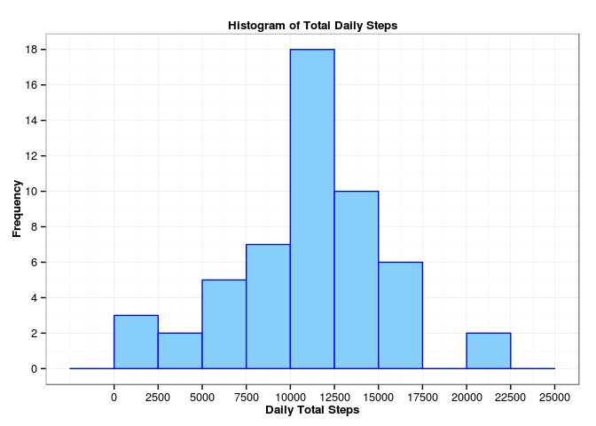
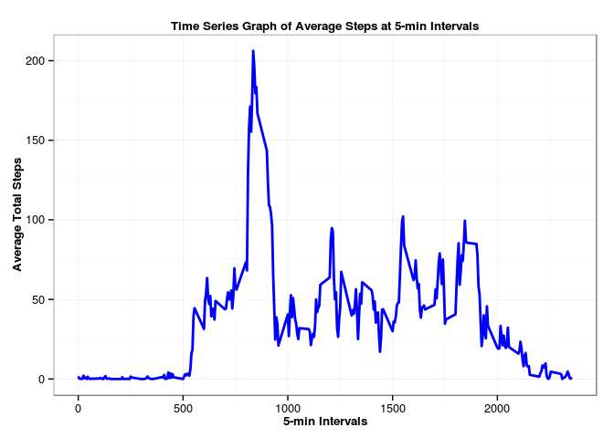
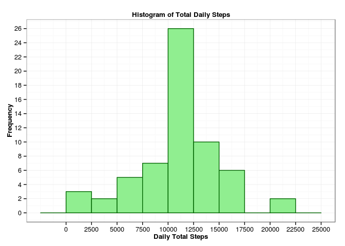
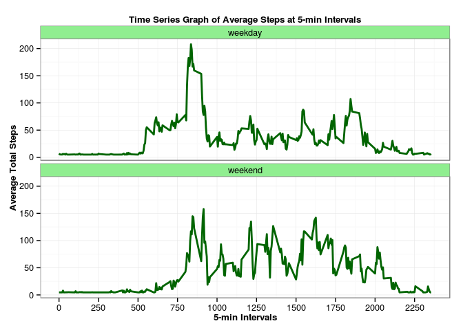

<br/>

## __Reproducible Research - Assignment 1__
<br/>

### __Introduction__
<br/>

This assignment makes use of data from a personal activity monitoring device. This device collects data at 5 minute intervals through out the day. The data consists of two months of data from an anonymous individual collected during the months of October and November, 2012 and include the number of steps taken in 5 minute intervals each day.

The data for this assignment can be downloaded from the course web site:

<a href="https://d396qusza40orc.cloudfront.net/repdata%2Fdata%2Factivity.zip">Activity monitoring data</a>:

The variables included in this dataset are:

__steps__: Number of steps taking in a 5-minute interval (missing values are coded as NA)
__date__: The date on which the measurement was taken in YYYY-MM-DD format
__interval__: Identifier for the 5-minute interval in which measurement was taken

The dataset is stored in a comma-separated-value (CSV) file and there are a total of 17,568 observations in this dataset.

<br/>

### __Assignment Steps__
<br/>

#### __0. Setup and Initialization__
<br/>

In this assignment, we will be using the R packages `data.table` and `ggplot2`. The following code segment loads the desired libraries:


```r
library(data.table)
library(ggplot2)
```
<br/>

#### __1. Loading and Preprocessing the Data__
<br/>

We downloaded the dataset and extracted the file `activity.csv` to the `~/Downdloads/DATA` directory. The following code loads the csv data into a `data.table` and converts the character __date__ column (in the YYYY-MM-DD format) into to R `Date` object using the `as.Date(x)` function:


```r
data <- fread("~/Downloads/DATA/activity.csv")
data$date <- as.Date(data$date, "%Y-%m-%d")
str(data)
```

```
## Classes 'data.table' and 'data.frame':	17568 obs. of  3 variables:
##  $ steps   : int  NA NA NA NA NA NA NA NA NA NA ...
##  $ date    : Date, format: "2012-10-01" "2012-10-01" ...
##  $ interval: int  0 5 10 15 20 25 30 35 40 45 ...
##  - attr(*, ".internal.selfref")=<externalptr>
```

```r
head(data)
```

```
##    steps       date interval
## 1:    NA 2012-10-01        0
## 2:    NA 2012-10-01        5
## 3:    NA 2012-10-01       10
## 4:    NA 2012-10-01       15
## 5:    NA 2012-10-01       20
## 6:    NA 2012-10-01       25
```
<br/>

#### __2. What is the Mean Total Number of Steps Taken per Day ?__
<br/>

The following code segment calculates the total number of __steps__ taken per day using the `data.table` expression __DT[,j,k]__ where `j` is the aggregate operation `sum(__steps__)` and `k` is the group operation `by=.(date)`. The resulting `data.table` is stored in the variable __q1__:


```r
q1 <- data[, .(total = sum(steps)), by = .(date)]
str(q1)
```

```
## Classes 'data.table' and 'data.frame':	61 obs. of  2 variables:
##  $ date : Date, format: "2012-10-01" "2012-10-02" ...
##  $ total: int  NA 126 11352 12116 13294 15420 11015 NA 12811 9900 ...
##  - attr(*, ".internal.selfref")=<externalptr>
```

```r
head(q1)
```

```
##          date total
## 1: 2012-10-01    NA
## 2: 2012-10-02   126
## 3: 2012-10-03 11352
## 4: 2012-10-04 12116
## 5: 2012-10-05 13294
## 6: 2012-10-06 15420
```

The following code segment plots a histogram of the total number of steps taken each day using the `data.table` __q1__ we just created above and using the `ggplot` plotting system:


```r
ggplot(q1, aes(x = q1[,total])) +
    geom_histogram(binwidth = 2500, fill = 'lightskyblue', color = 'blue') +
    scale_x_continuous(breaks = seq(0, 25000, 2500)) +
    scale_y_continuous(breaks = seq(0, 30, 2)) +
    labs(x = 'Daily Total Steps', y = 'Frequency') +
    ggtitle('Histogram of Total Daily Steps') +
    theme_bw() +
    theme(plot.title = element_text(face = 'bold', size = 10),
          axis.title = element_text(face = 'bold', size = 10))
```



The following code segment calculates and reports the `mean` and `median` of the total number of steps taken per day using the `data.table` __q1__ we just created above:

* __MEAN__


```r
mean.1 <- round(mean(q1[,total], na.rm = TRUE), digits = 2)
mean.1
```

```
## [1] 10766.19
```

* __MEDIAN__


```r
median.1 <- round(median(q1[,total], na.rm = TRUE), digits = 2)
median.1
```

```
## [1] 10765
```
<br/>

#### __3. What is the Average Daily Activity Pattern ?__
<br/>

The following code segment calculates the average number of __steps__ at the 5-minute interval taken across all days using the `data.table` expression __DT[,j,k]__ where `j` is the aggregate operation `mean(__steps__, na.rm = TRUE)` and `k` is the group operation `by=.(interval)`. The resulting `data.table` is stored in the variable __q2__:


```r
q2 <- data[, .(mean = mean(steps, na.rm = TRUE)), by = .(interval)]
str(q2)
```

```
## Classes 'data.table' and 'data.frame':	288 obs. of  2 variables:
##  $ interval: int  0 5 10 15 20 25 30 35 40 45 ...
##  $ mean    : num  1.717 0.3396 0.1321 0.1509 0.0755 ...
##  - attr(*, ".internal.selfref")=<externalptr>
```

```r
head(q2)
```

```
##    interval      mean
## 1:        0 1.7169811
## 2:        5 0.3396226
## 3:       10 0.1320755
## 4:       15 0.1509434
## 5:       20 0.0754717
## 6:       25 2.0943396
```

The following code segment plots a _Time Series_ plot of the 5-minute intervals (x-axis) and the average number of steps taken, averaged across all days (y-axis) using the `data.table` __q2__ we just created above and using the `ggplot` plotting system:


```r
ggplot(q2, aes(x = interval, y = mean)) +
    geom_line(color = 'blue', size = 1) +
    labs(x = '5-min Intervals', y = 'Average Total Steps') +
    ggtitle('Time Series Graph of Average Steps at 5-min Intervals') +
    theme_bw() +
    theme(plot.title = element_text(face = 'bold', size = 10),
          axis.title = element_text(face = 'bold', size = 10))
```



The following code segment reports the 5-minute interval at which the average number of steps across all the days in the dataset is the maximum using the `data.table` __q2__ we just created above:


```r
q2[which.max(q2[, mean]), interval]
```

```
## [1] 835
```
<br/>

#### __4. Imputing Missing Values__
<br/>

The following code segment calculates and reports the total number of missing values in the dataset (i.e. the total number of rows with __NA__s):


```r
na.idx <- which(is.na(data))
length(na.idx)
```

```
## [1] 2304
```

The following code segment creates a new dataset called __data.new__ that is equal to the original dataset __data__ but with the missing values (__NA__ values) filled in. We use a simple strategy of finding the average steps per day as the replacement value for the missing values:


```r
data.new <- data.table(data)
data.new$steps[na.idx] <- round(mean(data.new$steps, na.rm = TRUE), digits = 2)
str(data.new)
```

```
## Classes 'data.table' and 'data.frame':	17568 obs. of  3 variables:
##  $ steps   : num  37.4 37.4 37.4 37.4 37.4 ...
##  $ date    : Date, format: "2012-10-01" "2012-10-01" ...
##  $ interval: int  0 5 10 15 20 25 30 35 40 45 ...
##  - attr(*, ".internal.selfref")=<externalptr>
```

```r
head(data.new)
```

```
##    steps       date interval
## 1: 37.38 2012-10-01        0
## 2: 37.38 2012-10-01        5
## 3: 37.38 2012-10-01       10
## 4: 37.38 2012-10-01       15
## 5: 37.38 2012-10-01       20
## 6: 37.38 2012-10-01       25
```

The following code segment calculates the total number of __steps__ taken per day using the `data.table` expression __DT[,j,k]__ where `j` is the aggregate operation `sum(__steps__)` and `k` is the group operation `by=.(date)`. The resulting `data.table` is stored in the variable __q3__:


```r
q3 <- data.new[, .(total = sum(steps)), by = .(date)]
str(q3)
```

```
## Classes 'data.table' and 'data.frame':	61 obs. of  2 variables:
##  $ date : Date, format: "2012-10-01" "2012-10-02" ...
##  $ total: num  10765 126 11352 12116 13294 ...
##  - attr(*, ".internal.selfref")=<externalptr>
```

```r
head(q3)
```

```
##          date    total
## 1: 2012-10-01 10765.44
## 2: 2012-10-02   126.00
## 3: 2012-10-03 11352.00
## 4: 2012-10-04 12116.00
## 5: 2012-10-05 13294.00
## 6: 2012-10-06 15420.00
```

The following code segment plots a histogram of the total number of steps taken each day using the `data.table` __q3__ we just created above and using the `ggplot` plotting system:


```r
ggplot(q3, aes(x = q3[,total])) +
    geom_histogram(binwidth = 2500, fill = 'lightgreen', color = 'darkgreen') +
    scale_x_continuous(breaks = seq(0, 25000, 2500)) +
    scale_y_continuous(breaks = seq(0, 30, 2)) +
    labs(x = 'Daily Total Steps', y = 'Frequency') +
    ggtitle('Histogram of Total Daily Steps') +
    theme_bw() +
    theme(plot.title = element_text(face = 'bold', size = 10),
          axis.title = element_text(face = 'bold', size = 10))
```



The following code segment calculates and reports the `mean` and `median` of the total number of steps taken per day using the `data.table` __q3__ we just created above:

* __MEAN__


```r
mean.2 <- round(mean(q3[,total]), digits = 2)
mean.2
```

```
## [1] 10766.09
```

* __MEDIAN__


```r
median.2 <- round(median(q3[,total]), digits = 2)
median.2
```

```
## [1] 10765.44
```

Comparing this mean value 10766.09 to the mean 10766.19 from the first part of the assignment, we see there is not much difference.

Similarly, comparing this median value 10765.44 to the median 10765 from the first part of the assignment, we see there is not much difference.

So, in this use-case, there is no major impact of imputing missing data on the estimates of the total daily number of steps.

<br/>

#### __5. Are There Differences in Activity Patterns Between Weekdays and Weekends ?__
<br/>

The following code segment creates a new factor variable in the __data.new__ `data.table` called __wday__ with values `'weekday'` and `'weekend'` indicating whether the given day is a weekday or a weekend:


```r
data.new$wday <- ifelse(weekdays(data.new$date) %in% c("Saturday", "Sunday"),
                       'weekend', 'weekday')
```
The following code segment calculates the average number of __steps__ at the 5-minute interval across all weekdays and weekends using the `data.table` expression __DT[,j,k]__ where `j` is the aggregate operation `mean(__steps__)` and `k` is the group operation `by=.(interval, wday)`. The resulting `data.table` is stored in the variable __q4__:


```r
q4 <- data.new[, .(mean = mean(steps)), by = .(interval, wday)]
str(q4)
```

```
## Classes 'data.table' and 'data.frame':	576 obs. of  3 variables:
##  $ interval: int  0 5 10 15 20 25 30 35 40 45 ...
##  $ wday    : chr  "weekday" "weekday" "weekday" "weekday" ...
##  $ mean    : num  7.01 5.38 5.14 5.16 5.07 ...
##  - attr(*, ".internal.selfref")=<externalptr>
```

```r
head(q4)
```

```
##    interval    wday     mean
## 1:        0 weekday 7.006222
## 2:        5 weekday 5.384000
## 3:       10 weekday 5.139556
## 4:       15 weekday 5.161778
## 5:       20 weekday 5.072889
## 6:       25 weekday 6.295111
```

The following code segment creates a panel plot with two _Time Series_ plots of the 5-minute intervals (x-axis) and the average number of steps taken, averaged across weekday and weekends (y-axis) using the `data.table` __q4__ we just created above and using the `ggplot` plotting system:


```r
ggplot(q4, aes(x = interval, y = mean)) +
    geom_line(color = 'darkgreen', size = 1) +
    labs(x = '5-min Intervals', y = 'Average Total Steps') +
    ggtitle('Time Series Graph of Average Steps at 5-min Intervals') +
    scale_x_continuous(breaks = seq(0, 2500, 250)) +
    facet_wrap(~wday, nrow = 2) +
    theme_bw() +
    theme(strip.background = element_rect(fill = 'lightgreen')) +
    theme(plot.title = element_text(face = 'bold', size = 10),
          axis.title = element_text(face = 'bold', size = 10))
```



Looking at the graphs for the `weekday` and the `weekend` from the above two _Time Series_ plots, we can deduce the following two facts:

* There is more activity in the `weekday` between intervals __750__ and __1000__
* In general, there is more activity during the `weekend`
